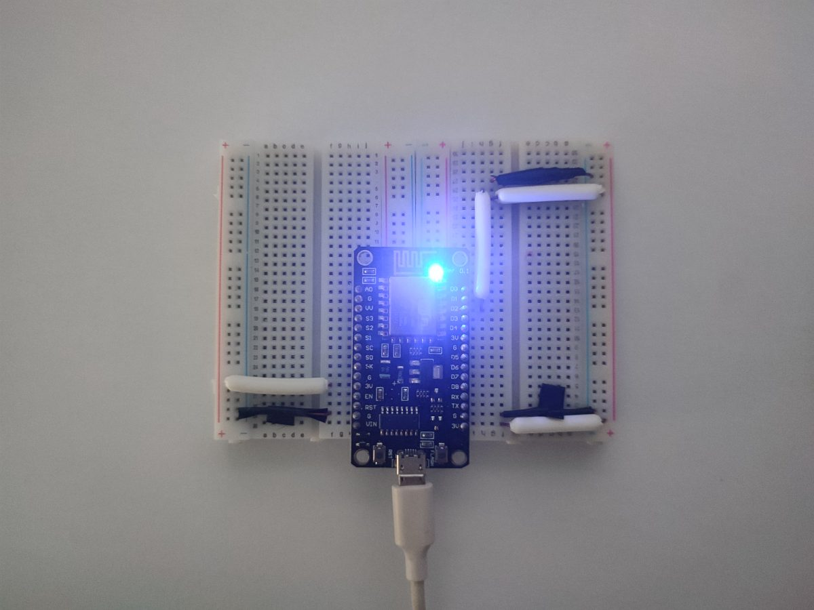
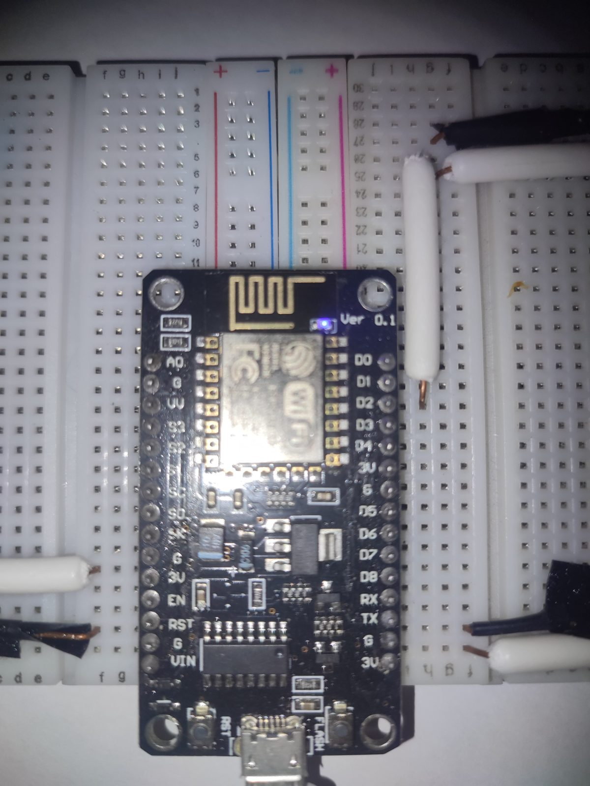
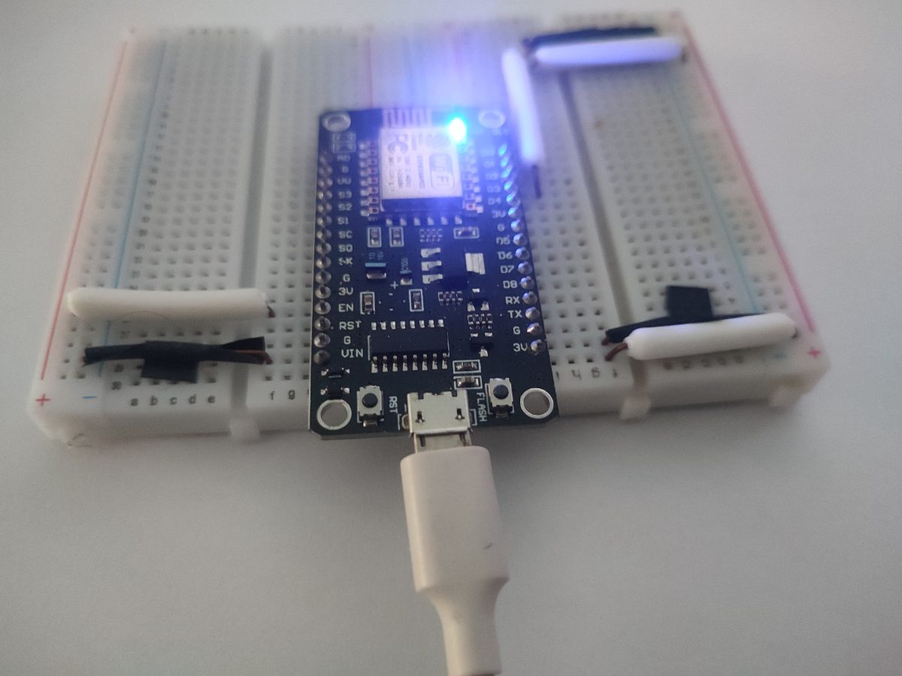

# ESP8266 Onboard LED Blink

> Practice project: 10Hz onboard LED blinker to learn proper GitHub repo structure for future ESP8266 projects.

---

## What It Does

Blinks the onboard blue LED on a NodeMCU ESP8266 at 10Hz (50ms on, 50ms off).  
This project serves as a template for organizing hardware projects with code, photos, and documentation.

---

## Hardware

| Component | Model | Qty | Notes |
|-----------|-------|-----|-------|
| Microcontroller | NodeMCU ESP8266 (ESP-12E) | 1 | Onboard LED on GPIO2 (D4) |
| USB Cable | Micro-USB | 1 | Power + programming |

---

## Pin Mapping

| ESP8266 Pin | Connected To | Function |
|-------------|--------------|----------|
| GPIO2 (D4) | Onboard LED | Blink indicator (Active-Low) |

> **Active-Low:** `LOW` = LED ON, `HIGH` = LED OFF

---

## Visual Guide

### Board Overview


### LED Close-up


### Side View


---

## Schematic

This project uses only the onboard LED — no external wiring required.

ESP8266 NodeMCU
┌─────────────┐
│         LED │◄── GPIO2 (D4)
│    [====]   │     (Active-Low)
│             │
│  USB        │
└─────────────┘


---

## Software

### PlatformIO Configuration

| Setting | Value |
|---------|-------|
| Platform | `espressif8266` |
| Board | `nodemcuv2` |
| Framework | `arduino` |

See [`platformio.ini`](platformio.ini) for full configuration.

### Build & Upload

1. Open project in VS Code with PlatformIO extension
2. Click **Build** (checkmark icon) or press `Ctrl+Alt+B`
3. Click **Upload** (arrow icon) or press `Ctrl+Alt+U`
4. The onboard blue LED should start blinking immediately

---

## How It Works

```cpp
digitalWrite(LED_BUILTIN, LOW);   // LED ON  (Active-Low)
delay(50);                        // 50ms
digitalWrite(LED_BUILTIN, HIGH);  // LED OFF
delay(50);                        // 50ms
// Cycle repeats → 10Hz blink

Frequency Note
Period: 50ms ON + 50ms OFF = 100ms
Frequency: 1 / 0.1s = 10Hz (10 full blinks per second)
For 20Hz, use delay(25) for both ON and OFF.

Files
Table
File	Description
src/main.cpp	Main source code
platformio.ini	PlatformIO build configuration
images/	Project photos
schematic/	Wiring diagrams (N/A for this project)

License
MIT — Use this as a template for your own projects.
